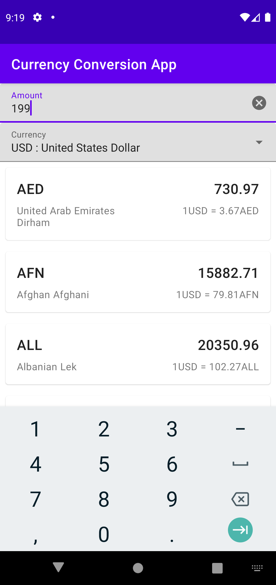

# MVVM Test Demo - Currency Conversion App
MVVM Testing Demo using mockito, mockk, mock webserver

## Requirements
- [Currencylayer API](http://currencylayer.com/documentation)
- Android Studio + SDK
- min SDK 21 (Lollipop)

## How to Run the App
- clone this project
- open using Android Studio
- create account and setup `API KEY` [Currencylayer API](http://currencylayer.com/documentation)
- copy `API KEY` and paste to `gradle.properties` file
- after finish fetch dependencies and indexing, you can run the app using run app icon

## Screenshots
